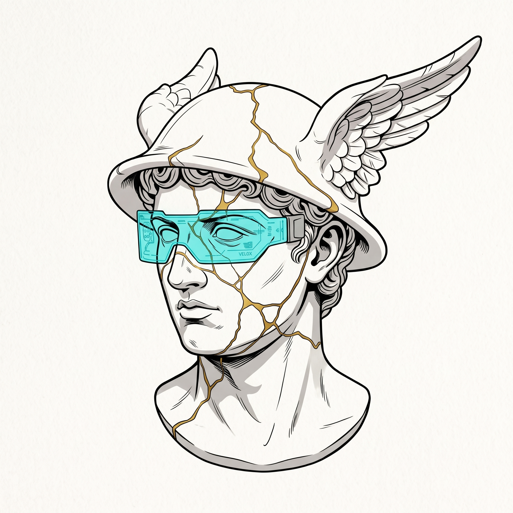

<div align="center">
  <p align="center">
    <a href="README.md"></a>
    <a href="README.fr.md"></a>
  </p>
  <p align="center">
    <b>🇬🇧 English Version</b> &nbsp;•&nbsp; <b><a href="README.fr.md">🇫🇷 Version Française</a></b>
  </p>

  
  <h1>⚡ VELOX GAMING LAUNCHER</h1>
  <p><strong>Ultra-lightweight, high-performance, and elegant game launcher for Windows with automatic playtime tracking and advanced analytics.</strong></p>

  <p>
    
    
    
    
    
    
    
  </p>

  <p>
    <a href="https://github.com/Ziad-Yousfi/Velox/releases/download/v1.0.0/Velox.exe">
      
    </a>
    <a href="https://github.com/Ziad-Yousfi/Velox/releases">
      
    </a>
  </p>
</div>

---

## 📖 About Velox

**Velox** (*"swift, rapid, nimble"* in Latin) is an independent video game launcher engineered to provide a responsive, modern, and resource-efficient alternative to bloated, power-hungry game clients.

Inspired by **Mercury (Mercurius)** — the Roman god of speed crowned with his winged helmet and reimagined through a cyberpunk aesthetic —, Velox fuses neo-classical art with high-speed performance.

---

## ✨ Key Features

### 🎮 Game Library Management
* **Responsive & Adaptive Grid**: Clean 4-column presentation with centered alignment, custom cover art, editable titles, and quick-action shortcuts.
* **Flexible Game Addition**:
  * Automatic directory scanning for game executables (`.exe`).
  * Manual addition with custom executable file selection and dedicated cover art association.
* **Full CRUD Management**: Edit game names, update covers, or delete games directly through each card's settings button.

### ⏱️ Automatic Playtime Tracking
* **Zero-Latency Background Tracking**: When you launch a game from Velox, its process is automatically traced via its Windows PID.
* **Accurate Session Logging**: Precise timestamps (date, start time, end time, duration in seconds) stored in the local SQLite database.
* **Non-Blocking UI**: The monitoring engine operates inside a lightweight dedicated worker thread with an intelligent 5-second polling interval (<0.1% CPU impact).

### 📊 In-Depth Analytics & Statistics
Velox includes two comprehensive tiers of playtime analytics:

#### 1. Individual Game Statistics
* **30-Day Playtime Bar Chart**: Interactive daily bars with visual color gradients illustrating recent gaming habits.
* **Calendar Heatmap**:
  * Monthly activity grid with 5 levels of color intensity.
  * Direct, legible playtime labels (e.g., `1h 45m` or `35m`) displayed inside every active daily cell.
  * Seamless month-by-month navigation and detailed session records.

#### 2. Global Library Analytics
* **2-Axis Orthogonal Chart (X = Games / Y = Hours)**: Direct graphical comparison of cumulative playtime across all your games with adaptive scaling and hover tooltips.
* **Combined Overview & Key KPIs**:
  * ⏱️ *Total playtime* accumulated across all games.
  * 🎮 *Total game count* in your library.
  * 🎯 *Total sessions* played.
  * ⏳ *Average session duration*.
  * 🏆 *Most played game* and its library share percentage.
  * 📈 *30-day global activity curve*.
  * 📊 *Complete distribution table* per game with progress gauges.

### 🎨 Dynamic Multi-Theme Engine
* Switch themes instantly in the Settings dialog:
  * **Velox Cyberpunk** (Deep electric dark with neon cyan and purple accents).
  * **Solarized Light** (High-contrast `#FDF6E3` light palette with dark golden hover `#D4A017`).
  * **Obsidian Dark** & variants.
* Instant theme application across all windows, dialogs, cards, and charts.

### 🛡️ Smart System Tray & Safe Shutdown
Velox cleanly distinguishes between minimizing and terminating:
* **Close Button (✕) or Alt+F4**: Minimizes the window to the Windows System Tray (`hide()`). The transparent Mercury icon stays active in the notification area, maintaining continuous background game tracking. Clicking the tray icon instantly restores the window.
* **Power Button (⏻)**: Located in the title bar and tray context menu, ensuring a clean and safe termination of all threads, background watchers, and the database connection.

---

## 🛠️ Architecture & Tech Stack

| Component | Technology | Rationale & Benefits |
|-----------|------------|-----------------------|
| **GUI Framework** | **PyQt6 (Qt 6 C++)** | Hardware-accelerated native rendering, fluid widgets, ~10x lower RAM footprint than Electron (~45 MB vs ~250 MB). |
| **Database** | **SQLite 3 (WAL Mode)** | Zero server setup, query caching, instant concurrent read/write transactions. |
| **Chart Engine** | **Custom QPainter 2D** | Zero heavy third-party plotting dependencies (no bloated matplotlib), ultra-fast anti-aliased vector rendering. |
| **Process Tracking** | **Threading + Win32 PID** | Non-blocking background worker thread with 5s sleep cycles: CPU overhead under 0.1%. |
| **Windows Identity** | **Win32 AppUserModelID** | Native Windows 10/11 taskbar integration without generic Python icons. |

---

## 📁 Project Structure

```
Velox/
├── README.md                     # Official documentation in English (default)
├── README.fr.md                  # Official documentation in French
├── Velox.exe                     # Standalone compiled executable
├── .gitignore
└── gaming-launcher/
    ├── Velox.spec                # PyInstaller build configuration
    ├── main.py                   # Application entry point, Qt init, fonts & icons
    ├── requirements.txt          # Python dependencies (PyQt6, Pillow)
    ├── icon/                     # Official visual identity
    │   ├── velox_icon.jpg        # High-resolution original artwork
    │   ├── velox_icon_transparent.png# Cutout emblem (pure transparent background)
    │   ├── velox.ico             # Multi-resolution Windows icon (16px to 256px)
    │   └── velox_transparent.ico # Transparent icon for system tray
    ├── assets/
    │   ├── fonts/                # Embedded fonts (Rajdhani)
    │   └── icons/                # Icon variants
    ├── core/                     # Business Logic & Data
    │   ├── database.py           # SQLite abstraction with query cache & WAL mode
    │   ├── models.py             # Data models (Game, Session)
    │   ├── theme.py              # Dynamic theme engine & color palettes
    │   └── tracker.py            # Process tracking & playtime monitor
    └── ui/                       # PyQt6 User Interface
        ├── main_window.py        # Frameless main window & custom title bar
        ├── game_card.py          # Interactive game card (hover, stats, play)
        ├── stats_window.py       # Per-game statistics (30d chart + heatmap)
        ├── global_stats_window.py# Global library analytics (orthogonal chart & KPIs)
        ├── add_game_dialog.py    # Game addition & folder scanner dialog
        └── edit_game_dialog.py   # Game editing and deletion dialog
```

---

## 🚀 Installation & Getting Started

### Option A: Direct Executable Download (Recommended - No Python Required)
1. Navigate to the [Velox v1.0.0 Releases page](https://github.com/Ziad-Yousfi/Velox/releases/tag/v1.0.0).
2. Download **[Velox.exe](https://github.com/Ziad-Yousfi/Velox/releases/download/v1.0.0/Velox.exe)**.
3. Launch the application directly!

---

### Option B: Running from Python Source

#### Prerequisites
* **Operating System**: Windows 10 or Windows 11 (64-bit).
* **Python**: Version 3.10 or higher ([python.org](https://www.python.org/)).

#### Step 1: Clone the Repository
```bash
git clone https://github.com/Ziad-Yousfi/Velox.git
cd Velox/gaming-launcher
```

#### Step 2: Create a Virtual Environment (Recommended)
```bash
python -m venv venv
.\venv\Scripts\activate
```

#### Step 3: Install Dependencies
```bash
pip install -r requirements.txt
```

#### Step 4: Run Velox
```bash
python main.py
```

---

## 🏗️ Building Standalone Executable (`.exe`)

The repository includes an optimized PyInstaller specification file ([Velox.spec](file:///e:/Documents/Developpement/Actif/Velox/gaming-launcher/Velox.spec)):

```bash
# 1. Navigate to the gaming-launcher directory
cd gaming-launcher

# 2. Compile using the spec file
pyinstaller Velox.spec --clean --noconfirm
```

The resulting standalone executable will be located in `dist/Velox.exe`.

---

## 🎮 Quick User Guide

| Action | How-To |
|--------|--------|
| **Add a game** | Click `+ AJOUTER` in the top bar, choose an `.exe` file and select a cover image. |
| **Launch a game** | Click `▶ JOUER` on the game card. Playtime recording starts instantly. |
| **View game stats** | Click the `📊` chart icon next to the Play button on any card. |
| **View global stats** | Click the `📊` icon in the top header to inspect the orthogonal comparator and KPIs. |
| **Switch themes** | Click the gear icon `⚙` to choose between dark, light, or cyberpunk modes. |
| **Minimize to tray** | Click the `✕` close button: Velox stays active in the system tray without losing tracking. |
| **Exit completely** | Click the red power button `⏻` in the title bar or right-click the tray icon and select exit. |

---

## 👤 Author & Contact

* **Author**: [Ziad Yousfi](https://github.com/Ziad-Yousfi)
* **Email**: `yousfiziadpro@gmail.com`
* **Repository**: [Velox Gaming Launcher](https://github.com/Ziad-Yousfi/Velox)

---

## 📄 License

This project is licensed under the **MIT License**. You are free to use, study, modify, and distribute it.
